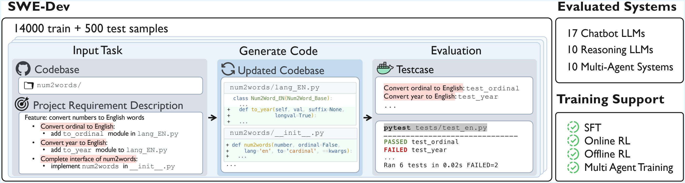

# SWE-Dev: Evaluating and Training Autonomous Feature-Driven Software Development

[](https://arxiv.org/abs/2410.16946)
[](https://yuzhu-cai.github.io/rSDE-Bench/)

Code and data for paper "[SWE-Dev: Evaluating and Training Autonomous Feature-Driven Software Development](https://arxiv.org/abs/2410.16946)".

## 👋 Overview
SWE-Bench is a ......




## 🚀 Set Up

Make sure to use python 3.8 or later:
```
conda create -n swe_bench python=3.8
conda activate swe_bench
```

Check out and install this repository:
```
git clone https://github.com/yifan-zhou1/SWE-Dev.git
cd SWE-Dev
pip install -r requirement.txt
```

## 💽 Usage
> [!WARNING]
> **Operating System:** Ensure that you are running this project on an operating system with a graphical user interface. Currently, **Windows** and **macOS** are supported.
> 
> **Dependencies:** Make sure all dependencies are correctly installed and the appropriate Python environment is activated.

Step1:

```bash
python step1.py
```

Step2:

```bash
python step2.py
```

Step3:

```
python step3.py
```


## ✍️ Citation

If you find our work helpful, please use the following citations.


